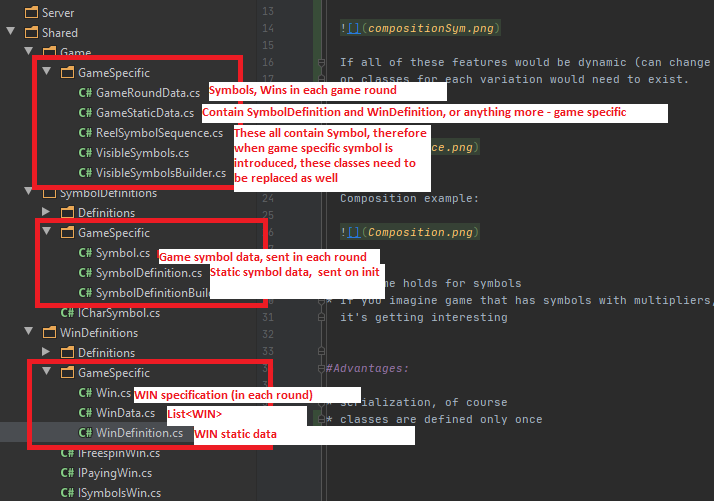
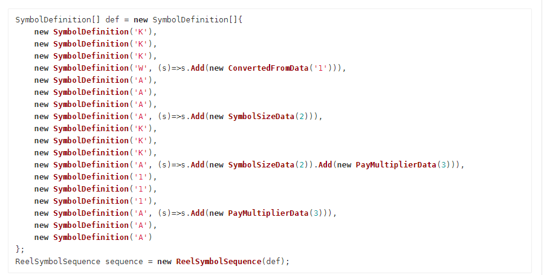
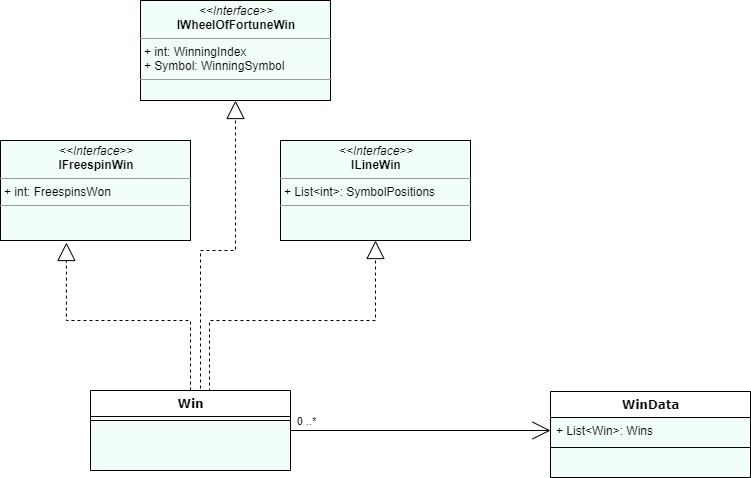
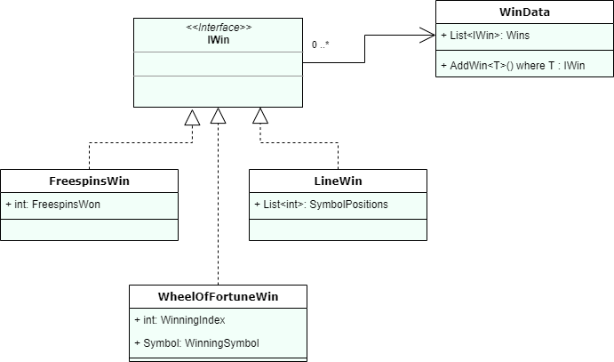

#Disadvantages:

* many classes that are game specific. Works as default solution, but if there is just one special feature, all of them need to be replaced

  

* symbol or win data classes can be defined based on interfaces, but their container classes need to contain all of the types,
  because we can't hide multiple implementations behind interface.
  
  Which means, that this isn't possible:
  
  
  
  If all of these features would be dynamic (can change in each game round), each Symbol would need to contain fields for all of them,
  or classes for each variation would need to exist. 
  
  Inheritance example:
  
  
  
  
  Composition example:
  
  
  
  
* The same holds for symbols
* If you imagine game that has symbols with multipliers, wild and expanding symbols, freespins, bigwin, wheel of fortune and multiple other features, 
  it's getting interesting 
  
  
#Advantages:

* serialization, of course
* classes are defined only once